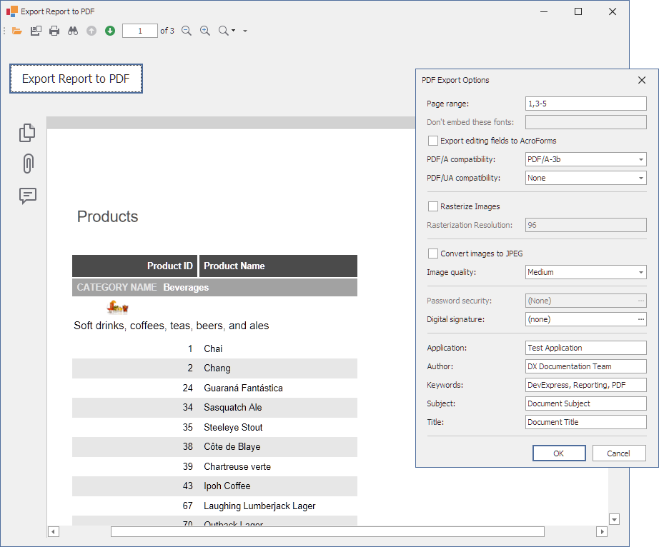

<!-- default badges list -->

<!-- default badges end -->
# How to Export a Report to PDF and Specify Export Options

This example uses the [XtraReport.ExportToPdf](https://docs.devexpress.com/XtraReports/DevExpress.XtraReports.UI.XtraReport.ExportToPdf(System.String-DevExpress.XtraPrinting.PdfExportOptions)) method to export a report to PDF, and calls the [ExportOptionsTool.EditExportOptions](https://docs.devexpress.com/WindowsForms/DevExpress.XtraPrinting.ExportOptionsTool.EditExportOptions(DevExpress.XtraPrinting.ExportOptionsBase-DevExpress.XtraPrinting.PrintingSystemBase)) method to invoke the dialog that allows the user to specify multiple export options.
 

## Files to Look At

* [Form1.cs](CS/ReportExportPdfSample/Form1.cs) ( VB: [Form1.vb](VB/ReportExportPdfSample/Form1.vb))

## Documentation

- [Export to PDF](https://docs.devexpress.com/XtraReports/2574)

## More Examples

- [How to export a report to ZUGFeRD](https://github.com/DevExpress-Examples/Reporting_how-to-export-a-report-to-zugferd-t234531)
<!-- feedback -->
## Does this example address your development requirements/objectives?

 

(you will be redirected to DevExpress.com to submit your response)
<!-- feedback end -->
